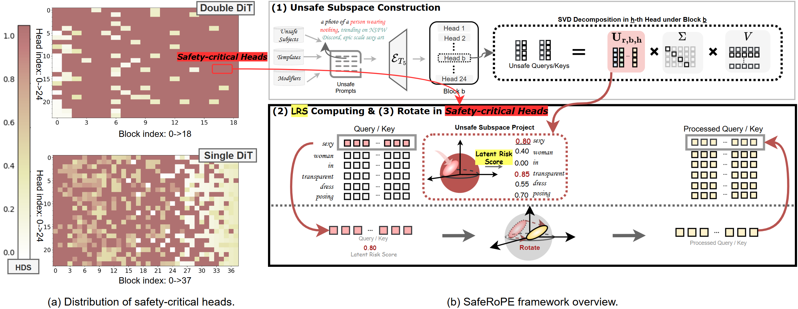

# SafeRoPE

### Risk-specific Head-wise Embedding Rotation for Safe Generation in Rectified Flow Transformers

Official implementation of the paper:

**SafeRoPE: Risk-specific Head-wise Embedding Rotation for Safe Generation in Rectified Flow Transformers**

------

## 📢 News

- 🎉 **Paper accepted** at *CVPR26*.
- 🔓 Code and reproducibility package released.
- 🧪 Experiments implemented on **FLUX**.

------

# 🧭 Overview

SafeRoPE is a **training-efficient safety alignment framework** designed for modern **Rectified Flow Transformers**, such as **FLUX** and **MMDiT-based diffusion models**.

Unlike existing safety alignment methods that require **full model finetuning**, **SafeRoPE performs lightweight head-wise semantic control inside attention layers**.

The key idea is:

> Unsafe semantics concentrate in **low-dimensional subspaces of specific attention heads**.

SafeRoPE identifies these **risk-related semantic directions** and applies **orthogonal rotations in RoPE positional space** to suppress unsafe generations while **preserving visual fidelity and semantic diversity**.

------

# 🧠 Method Illustration

Below illustrates the core idea of SafeRoPE.

```
Unsafe prompts
      │
      ▼
Q/K Activations (per head)
      │
      ▼
SVD Decomposition
      │
      ▼
Unsafe Subspace U_{b,h}
      │
      ▼
Skew-Symmetric Matrix A_{b,h}
      │
      ▼
Rotation via exp(A_{b,h})
      │
      ▼
Rotated Q/K vectors
      │
      ▼
Safe Image Generation
```

------

## Method Diagram



*Figure: SafeRoPE framework. Unsafe semantic directions are extracted from head-wise Q/K activations and suppressed through orthogonal rotations in RoPE space.*

------

# 🔬 Core Insight

SafeRoPE relies on three empirical observations in **Rectified Flow Transformers**:

1. **Unsafe semantics cluster in low-dimensional attention subspaces**
2. Only a **small subset of attention heads** are safety-critical
3. Unsafe directions can be suppressed by **rotating embeddings within RoPE space**

For each safety-critical head, SafeRoPE learns a **skew-symmetric matrix**
$A_{b,h} \in \mathbb{R}^{r\times r}$

and applies a **rotation transformation**
$R_{b,h} = \exp(A_{b,h})$

This guarantees:

- orthogonality
- stable attention geometry
- minimal disruption to safe semantics

------

# ⚙️ Algorithm

The SafeRoPE training procedure is summarized below.

### Algorithm Steps

1. **Unsafe Subspace Extraction**
   - Collect Q/K activations from unsafe prompts
   - Perform **head-wise SVD**
   - Extract principal unsafe directions
2. **Safety-Critical Head Identification**
   - Compute head discrimination scores
   - Select heads with strongest unsafe signals
3. **Rotation Matrix Training**
   - Train **skew-symmetric matrices**
   - Apply rotation only in unsafe subspaces
4. **Safe Inference**
   - Rotate Q/K embeddings at runtime
   - Preserve safe generation quality

------

# 📊 Experimental Results

SafeRoPE achieves **strong safety improvements with minimal generation degradation**.

## Quantitative Results

Key observations:

- Significant **unsafe generation reduction**
- Minimal impact on **image quality**
- **No retraining of base diffusion model**

------

# 🖼 Qualitative Examples

## Unsafe Prompt Suppression

SafeRoPE effectively suppresses unsafe visual concepts while preserving scene composition.

| Prompt                | Baseline (FLUX)   | SafeRoPE   |
| --------------------- | ----------------- | ---------- |
| unsafe prompt example | unsafe generation | suppressed |

More visual examples can be found in:

```
demo_saferope_inference.ipynb
```

------

# 🧩 Repository Structure

```
saferope/
│
├── README.md
├── environment.yaml
│
├── extract_unsafe_subspace.py
│       # Collect unsafe Q/K activations
│       # Perform SVD to obtain unsafe bases
│
├── train_rotary_adapter.py
│       # Train skew-symmetric matrices
│
├── inference_saferope.py
│       # Safe inference pipeline
│
├── demo_saferope_inference.ipynb
│       # Visual demo notebook
│
├── figures/
│       # paper figures used in README
```

------

# 🚀 Installation

## 1. Clone repository

```
git clone https://github.com/yourname/SafeRoPE.git
cd SafeRoPE
```

------

## 2. Create Conda Environment

```
conda env create -f environment.yaml
conda activate saferope
```

------

# 🛠 Pipeline Usage

SafeRoPE consists of **three major stages**.

------

# Step 1 — Extract Unsafe Subspace

```
python extract_unsafe_subspace.py
```

This script:

- collects Q/K activations
- performs **head-wise SVD**
- extracts **unsafe semantic directions**

Outputs:

```
head_{b}_{h}.pt
```

------

# Step 2 — Train Rotary Adapter

```
python train_rotary_adapter.py
```

Training updates only:

- skew-symmetric matrices
- unsafe subspace rotations

**Base FLUX weights remain frozen.**

Output checkpoint:

```
rotary_adapter_s_param.pth
```

------

# Step 3 — Safe Inference

Script:

```
python inference_saferope.py
```

or use the notebook:

```
demo_saferope_inference.ipynb
```

The notebook includes:

- baseline generation
- SafeRoPE generation
- visual comparison

------

# 📈 Efficiency

SafeRoPE is extremely lightweight.

| Method          | Trainable Params |
| --------------- | ---------------- |
| Full Finetuning | >1B              |
| Concept Editing | Millions         |
| **SafeRoPE**    | **<10K**         |

Each head only requires a **small skew-symmetric matrix**.

------

# 🔍 Reproducibility

The repository provides:

- full training pipeline
- inference scripts
- demonstration notebook

Experiments were conducted on:

- **FLUX Rectified Flow Transformer**
- **MMDiT architecture**

------

# 📄 Citation

If you find this work useful, please cite:

```bibtex
@article{saferope2026,
  title={SafeRoPE: Risk-specific Head-wise Embedding Rotation for Safe Generation in Rectified Flow Transformers},
  author={Xiang Yang, Feifei Li, Mi Zhang, Geng Hong, Xiaoyu You, Min Yang},
  journal={CVPR 26},
  year={2026}
}
```

------

# ⭐ Acknowledgements

We thank the open-source community for providing tools and models used in this work, including:

- FLUX
- Diffusers
- PyTorch

